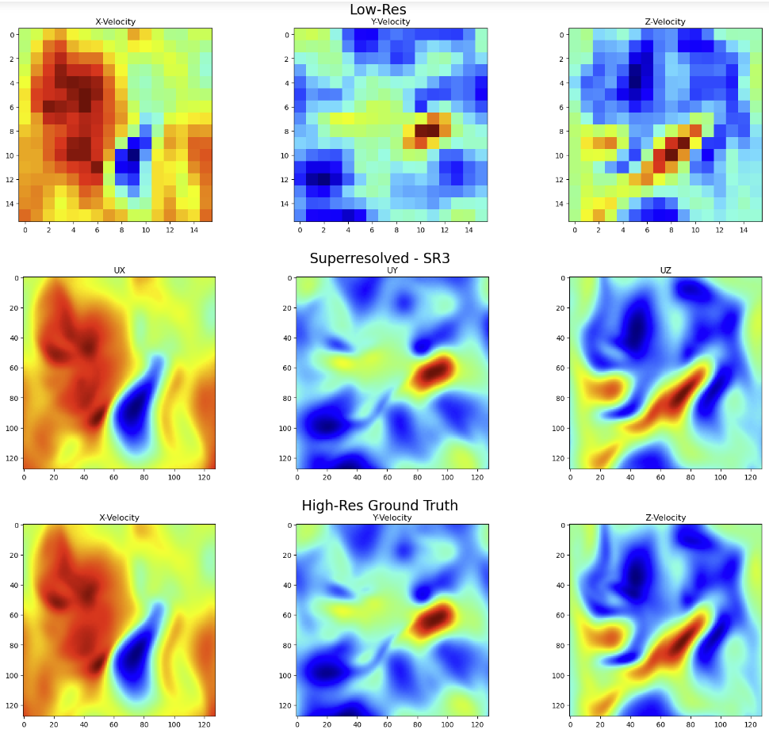

# FLAME AI Workshop - Superresolution of Turbulent Data

[Workshop Website](https://flame-ai-workshop.github.io) | [Kaggle](https://www.kaggle.com/competitions/2023-flame-ai-challenge)

This is repository for a submission for the Stanford FLAME AI workshop for superresolving turbulent flow data.\
\
*The model used is an SR3 diffusion model taken directly from*: https://github.com/Janspiry/Image-Super-Resolution-via-Iterative-Refinement\
The corresponding paper can be found here: [Image Super-Resolution via Iterative Refinement(SR3)](https://arxiv.org/pdf/2104.07636.pdf ).\
\
An example result from the validation set can be seen below with corresponding low-resolution input and high-resolution ground truth.

  

The SR3 model was run twice, first with [ux,uy,uz] as input channels, then with [rho,uy,uz] as input channels. For the final results ux, uy, uz is taken from the first run, while rho is taken from the second run.\
\

A pretrained model was downloaded from the above [GitHub](https://github.com/Janspiry/Image-Super-Resolution-via-Iterative-Refinement), the pretrained weights can be found here: [Google Drive](https://drive.google.com/drive/folders/12jh0K8XoM1FqpeByXvugHHAF3oAZ8KRu)\
The instruction on how to use the SR3 model for training and inference can also be found in the above [repository](https://github.com/Janspiry/Image-Super-Resolution-via-Iterative-Refinement)\
The model was first trained until 1000000 iterations using the above mentioned pre-trained weights and the [ux,uy,uz] version of the turbulence training data.\
The model then was trained for another 200000 iteration using the [rho,uy,uz] formulation. Checkpoints to both are provided on OneDrive, along with the png and .mdb version of datasets.

